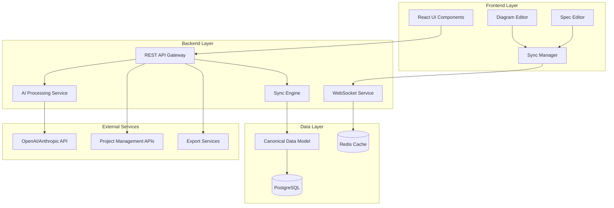

# FlowSketch Core Design Document

## Overview

FlowSketch is a web-based application that transforms unstructured text into synchronized diagrams and specifications using AI. The system consists of a React frontend with real-time editing capabilities, a Node.js backend with AI integration, and a bidirectional synchronization engine that maintains consistency between visual and textual representations.

## Architecture

### High-Level Architecture



### Technology Stack

**Frontend:**
- React 18 with TypeScript for component-based UI
- React Flow for interactive diagram editing
- Monaco Editor for specification editing with syntax highlighting
- Socket.io-client for real-time synchronization
- Tailwind CSS for responsive styling

**Backend:**
- Node.js with Express.js for REST API
- Socket.io for WebSocket connections
- TypeScript for type safety
- Prisma ORM for database operations

**AI & Processing:**
- OpenAI GPT-4 or Anthropic Claude for text parsing and generation
- spaCy for natural language entity extraction
- Custom parsing algorithms for relationship detection

**Diagram Generation:**
- Mermaid.js for diagram syntax generation
- Custom layout algorithms for auto-positioning
- SVG manipulation for export formats

**Data Storage:**
- PostgreSQL for persistent data storage
- Redis for session management and real-time sync state
- File storage (AWS S3) for exported assets

## Components and Interfaces

### Core Components

#### 1. Text Parser Service
```typescript
interface TextParserService {
  parseText(input: string): Promise<ParsedContent>
  extractEntities(text: string): Promise<Entity[]>
  identifyRelationships(entities: Entity[]): Promise<Relationship[]>
  determineDiagramType(content: ParsedContent): DiagramType
}

interface ParsedContent {
  entities: Entity[]
  relationships: Relationship[]
  suggestedDiagramType: DiagramType
  confidence: number
}
```

#### 2. Diagram Engine
```typescript
interface DiagramEngine {
  generateDiagram(content: ParsedContent): Promise<DiagramData>
  updateDiagram(changes: DiagramChange[]): Promise<DiagramData>
  exportDiagram(format: ExportFormat): Promise<Buffer>
  validateDiagram(diagram: DiagramData): ValidationResult
}

interface DiagramData {
  id: string
  type: DiagramType
  nodes: Node[]
  edges: Edge[]
  layout: LayoutConfig
  metadata: DiagramMetadata
}
```

#### 3. Specification Generator
```typescript
interface SpecificationGenerator {
  generateSpec(diagram: DiagramData): Promise<Specification>
  updateSpec(changes: SpecChange[]): Promise<Specification>
  generateAcceptanceCriteria(spec: Specification): Promise<AcceptanceCriteria[]>
  generateTests(spec: Specification, language: string): Promise<TestScaffold>
}

interface Specification {
  id: string
  title: string
  sections: SpecSection[]
  acceptanceCriteria: AcceptanceCriteria[]
  metadata: SpecMetadata
}
```

#### 4. Synchronization Engine
```typescript
interface SynchronizationEngine {
  syncDiagramToSpec(diagramChanges: DiagramChange[]): Promise<SpecChange[]>
  syncSpecToDiagram(specChanges: SpecChange[]): Promise<DiagramChange[]>
  resolveConflicts(conflicts: SyncConflict[]): Promise<Resolution[]>
  validateSync(canonicalModel: CanonicalModel): Promise<ValidationResult>
}

interface CanonicalModel {
  projectId: string
  entities: Entity[]
  relationships: Relationship[]
  businessRules: BusinessRule[]
  lastModified: Date
  version: number
}
```

### API Interfaces

#### REST API Endpoints
```typescript
// Project Management
POST   /api/projects                    // Create new project
GET    /api/projects/:id               // Get project details
PUT    /api/projects/:id               // Update project
DELETE /api/projects/:id               // Delete project

// Text Processing
POST   /api/projects/:id/parse         // Parse text input
POST   /api/projects/:id/generate      // Generate initial diagram & spec

// Diagram Operations
GET    /api/projects/:id/diagram       // Get current diagram
PUT    /api/projects/:id/diagram       // Update diagram
POST   /api/projects/:id/diagram/export // Export diagram

// Specification Operations
GET    /api/projects/:id/specification // Get current spec
PUT    /api/projects/:id/specification // Update spec
POST   /api/projects/:id/tests/generate // Generate test scaffolds

// Export & Sharing
POST   /api/projects/:id/export        // Export project
POST   /api/projects/:id/share         // Create shareable link

// External Integrations
POST   /api/projects/:id/integrations/jira    // Push to Jira
POST   /api/projects/:id/integrations/trello  // Push to Trello
POST   /api/projects/:id/integrations/linear  // Push to Linear
```

#### WebSocket Events
```typescript
// Real-time synchronization events
interface WebSocketEvents {
  'diagram:update': (changes: DiagramChange[]) => void
  'spec:update': (changes: SpecChange[]) => void
  'sync:conflict': (conflict: SyncConflict) => void
  'sync:resolved': (resolution: Resolution) => void
  'user:cursor': (position: CursorPosition) => void
  'project:lock': (lockInfo: LockInfo) => void
}
```

## Data Models

### Core Entities

```typescript
interface Project {
  id: string
  name: string
  description: string
  ownerId: string
  canonicalModel: CanonicalModel
  createdAt: Date
  updatedAt: Date
  isPublic: boolean
  shareToken?: string
}

interface Entity {
  id: string
  name: string
  type: EntityType
  properties: Property[]
  position?: Position
  metadata: EntityMetadata
}

interface Relationship {
  id: string
  sourceId: string
  targetId: string
  type: RelationshipType
  label?: string
  properties: Property[]
  metadata: RelationshipMetadata
}

interface Node {
  id: string
  entityId: string
  position: Position
  size: Size
  style: NodeStyle
  label: string
}

interface Edge {
  id: string
  relationshipId: string
  sourceNodeId: string
  targetNodeId: string
  style: EdgeStyle
  label?: string
  path?: Point[]
}
```

### Synchronization Models

```typescript
interface DiagramChange {
  type: 'node:add' | 'node:update' | 'node:delete' | 'edge:add' | 'edge:update' | 'edge:delete'
  nodeId?: string
  edgeId?: string
  data: any
  timestamp: Date
  userId: string
}

interface SpecChange {
  type: 'section:add' | 'section:update' | 'section:delete' | 'content:update'
  sectionId?: string
  content?: string
  position?: number
  timestamp: Date
  userId: string
}

interface SyncConflict {
  id: string
  type: ConflictType
  diagramChange: DiagramChange
  specChange: SpecChange
  suggestedResolution: Resolution
}
```

## Error Handling

### Error Categories

1. **Input Validation Errors**
   - Invalid text format
   - Unsupported diagram types
   - Malformed API requests

2. **AI Processing Errors**
   - API rate limits exceeded
   - Parsing failures
   - Low confidence results

3. **Synchronization Errors**
   - Conflict resolution failures
   - Data consistency violations
   - Concurrent modification conflicts

4. **Export Errors**
   - Format conversion failures
   - File size limitations
   - External service unavailability

### Error Handling Strategy

```typescript
interface ErrorHandler {
  handleInputError(error: InputError): ErrorResponse
  handleAIError(error: AIError): ErrorResponse
  handleSyncError(error: SyncError): ErrorResponse
  handleExportError(error: ExportError): ErrorResponse
}

interface ErrorResponse {
  code: string
  message: string
  details?: any
  suggestedAction?: string
  retryable: boolean
}
```

## Testing Strategy

### Unit Testing
- Component-level testing for React components using Jest and React Testing Library
- Service-level testing for backend APIs using Jest and Supertest
- Algorithm testing for parsing and synchronization logic
- Mock external AI services for consistent testing

### Integration Testing
- End-to-end workflow testing from text input to diagram generation
- Bidirectional sync testing between diagram and specification
- Export functionality testing across all supported formats
- WebSocket communication testing for real-time features

### Performance Testing
- Load testing for concurrent users editing the same project
- Stress testing for large diagrams with many nodes and relationships
- AI processing performance testing with various input sizes
- Database query optimization testing

### Test Data Strategy
- Synthetic test projects covering various diagram types
- Edge cases for parsing ambiguous text
- Conflict scenarios for synchronization testing
- Large-scale projects for performance validation

### Automated Testing Pipeline
```yaml
# CI/CD Pipeline Testing Stages
stages:
  - lint: ESLint, Prettier, TypeScript compilation
  - unit: Jest unit tests with coverage reporting
  - integration: API and WebSocket integration tests
  - e2e: Playwright end-to-end tests
  - performance: Load testing with Artillery
  - security: OWASP dependency scanning
```

### Test Coverage Goals
- Unit tests: 90% code coverage
- Integration tests: All API endpoints and WebSocket events
- E2E tests: Critical user journeys and edge cases
- Performance tests: Response time < 2s for 95% of requests